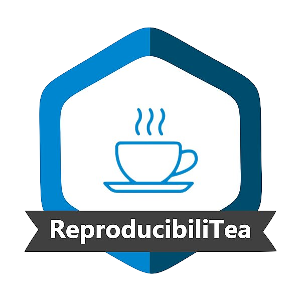

```{r setup, include=FALSE}
knitr::opts_chunk$set(echo = TRUE)
```

# Reproducible workflow

Welcome to the github repository of the Rmarkdown project for the ReproducibiliTea January 2022 session.



## R Markdown

Link to the little survey to get some data to be analyzed:

## Information on the software/packages used to run the presentation script.

### Package dependencies

- `tidyverse` the absolute essentials for tidy data analysis and contains everything you need to knit nice RMarkdown documents
- `faux` simulates correlated data with `rnorm_multi``
- `finalfit` one of my favorite packages for tidy analysis of clinical/medical data
- `ggpubr` creates publication ready plots based on ggplot2

## Session Information

**R-Version:** `r getRversion()`  
**RStudio-Version:** `r rstudioapi::versionInfo()$version`

```{r echo=FALSE}

sessionInfo()

```


