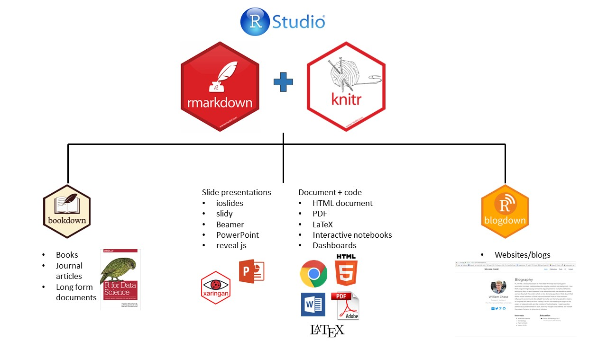
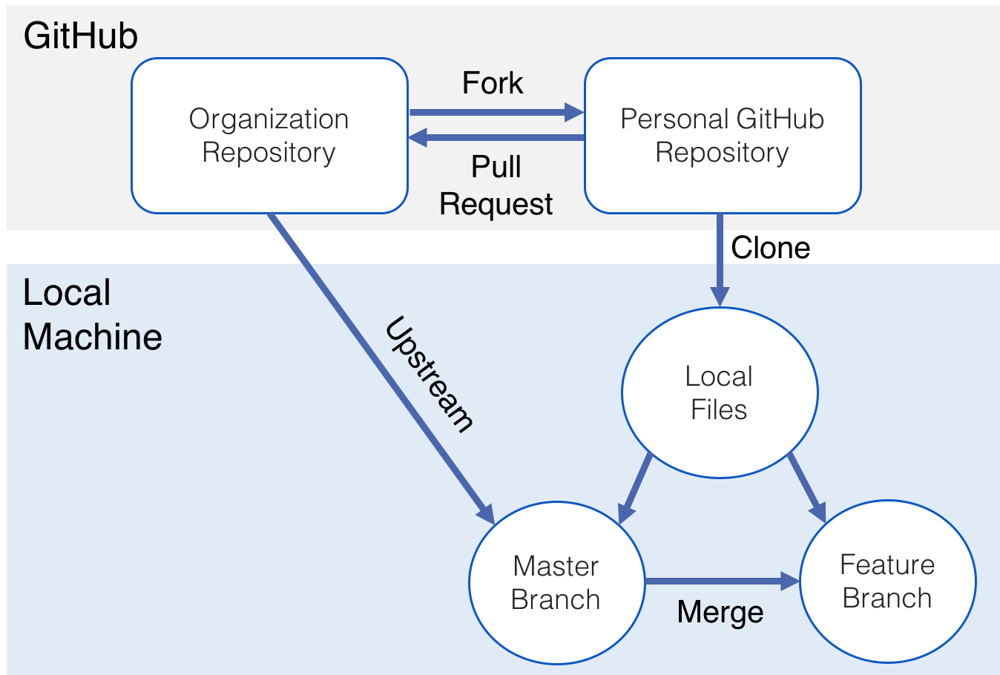

```{r setup, include=FALSE}
library(knitr)
knitr::opts_chunk$set(echo = FALSE)
```

## Why do we need reproducible data analysis?

"Reproducibility is the ability to obtain identical results from the same statistical analysis and the same data"

\bigskip

\large

= **long-term** and **cross-platform** reproducibility of data analyses

```{=tex}
\bigskip
\normalsize
```
\centering -- @Peikert2021

------------------------------------------------------------------------

```{=tex}
\centering
\Large
```
Reproducibility ≠ Replicability

\normalsize

(same analysis **new data**)

## Goals of reproducible workflows

\fontsize{14pt}{12}\selectfont

1.  **Reported** results are consistent with the **actual** results \linebreak
2.  Computational reproducibility (= hardware and software change over time)\linebreak
3.  Version control (= keep track of any changes at any time)

## Four essential tools for reproducible workflows

\large

1.  Dynamic reports $\rightarrow$ **R Markdown** \faIcon{r-project} \linebreak
2.  Version control $\rightarrow$ **Git & Github** \faIcon{github} \linebreak
3.  Dependency management $\rightarrow$ **Make** \linebreak
4.  Containerization $\rightarrow$ **Docker** \faIcon{docker} \linebreak

## Highly versatile dynamic documents with **R Markdown**

```{r rmarkdown, echo=FALSE, fig.align='center', out.height='75%'}



```

\footnotesize
https://rmarkdown.rstudio.com/authoring_quick_tour.html

## Happy knitting!

\centering

{width=1.5in}


\footnotesize
https://rmarkdown.rstudio.com/authoring_quick_tour.html

## Git & Github 

\small

:::::::::::::: {.columns}
::: {.column}

###  \faIcon{git-alt} Git

- "Distributed version control system"
- Track and document changes ("commits")
- Retrieve older versions of code
- Enables collaboration on any kind of programming projects (scalable!)

:::
::: {.column}

###  \faIcon{github} Github

\vfil

:::
::::::::::::::

## Git & Github 

\small

:::::::::::::: {.columns}
::: {.column}

###  \faIcon{git-alt} Git

- "Distributed version control system"
- Track and document changes ("commits")
- Retrieve older versions of code
- Enables collaboration on any kind of programming projects (scalable!)

:::
::: {.column}

###  \faIcon{github} Github

- Git repository hosting service 
* **Collaboration**:
  - Many features for team/project management (scalable!)
  - Report bugs/issues, get help
  - Contribute to open-source projects
- Post-publication platform

:::
::::::::::::::

## Collaboration with Git & Github

```{r git-workflow, echo=FALSE, fig.align='center', out.height='75%'}



```

\footnotesize
[How to Update a Fork in Git](https://medium.com/@sahoosunilkumar/how-to-update-a-fork-in-git-95a7daadc14e)

## \faIcon{docker} Docker 

Docker is a tool that allows encapsulation, sharing, and re-creation of a computational environment on most operating systems (Windows, macOS, & Linux).

# Reproducible data analysis in action

## Hypothesis: R skills predict early PhD completion

## Simulate and vizualize data

## Get the data

link/QR code to google forms

## Run the code!

## Where to start

Links/ressources for these tools

## R Appendix: R Figure Example

The following code generates the plot on the next slide (taken from `help(bxp)` and modified slightly):

```{r pressureCode, eval=FALSE}
library(stats)
set.seed(753)
bx.p <- boxplot(split(rt(100, 4),
                      gl(5, 20)), plot=FALSE)
bxp(bx.p, notch = FALSE, boxfill = "lightblue",
    frame = FALSE, outl = TRUE,
    main = "Example from help(bxp)")
```

## R Appendix: R Figure Example

```{r pressureFig, echo=FALSE, fig.align='center', out.width='80%'}
library(stats)
set.seed(753)
bx.p <- boxplot(split(rt(100, 4),
                      gl(5, 20)), plot=FALSE)
bxp(bx.p, notch = FALSE, boxfill = "lightblue",
    frame = FALSE, outl = TRUE,
    main = "Example from help(bxp)")
```

## R Appendix: R Table Example

A simple `knitr::kable` example:

```{r kableEx, echo=FALSE}
knitr::kable(mtcars[1:5, 1:8],
             caption="(Parts of) the mtcars dataset")
```

## References


